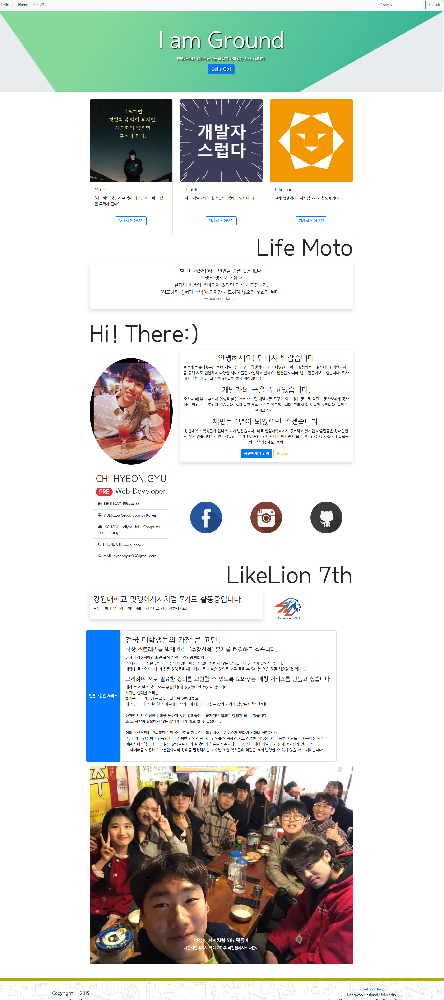

# 자기소개 프론트 페이지 만들기
## BootStrap사용하기

### 파일
- first_introduction : 처음 HTML CSS를 배워서 만들어 봄
- HyeonGyu_Introduction : BootStrap을 사용하여 만든 자기소개 페이지

### 스크린샷
> 사진경로 : ./image

#### HTML Rendering > [자기소개 페이지](http://htmlpreview.github.io/?https://github.com/HyeonGyuChi/LikeLion7_RegularSession/blob/master/2weeks/HyeonGyu_Introduction.html)

