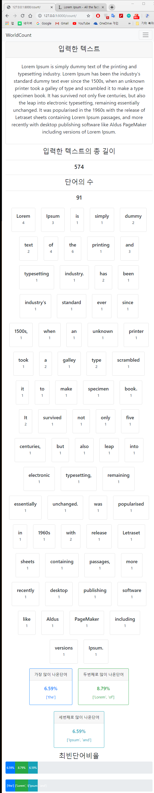

# WORD COUNT 프로젝트
## 프론트엔드 : BootStrap이용

### 프로젝트명
- myproj

### Application :
- wordcount : 텍스트를 입력시 단어별 개수나 비율, 최빈단어를 출력

### 기능
#### 텍스트 분석
> 단어개수 및 단어별 빈도수, 총길이
> 최빈단어 1~3위 Visualtiztion

### 스크린샷
> 사진경로 : ./Preview

#### ● 텍스트입력

#### ● 분석결과 - 최빈단어비율

#### ● 반응형 웹 - 위 IMG 텍스트입력 기준 데이터

