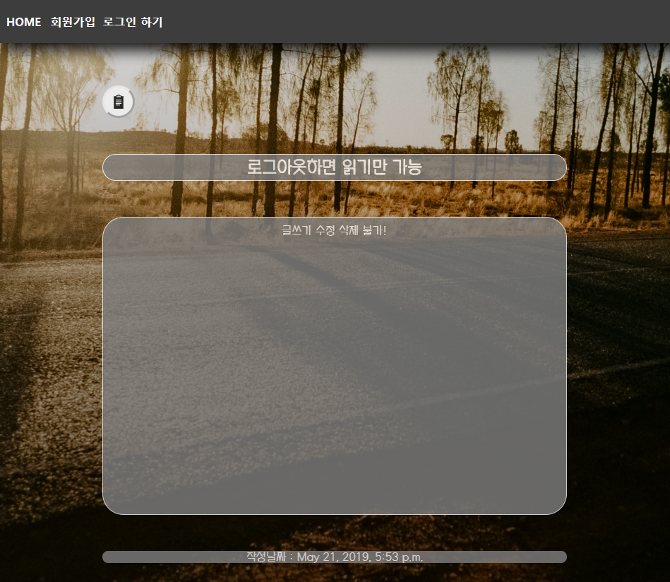

# CRUD 를 이용한 게시판 만들기
## 프론트엔드 : BootStrap 없이 Template 구성

### 프로젝트명
- mydjangoproject

### Application :
- blog : CRUD를 이용한 게시판
- imageview : static media 테스트
- login : 회원가입 및 로그인

### 기능
#### 회원가입 후 이용가능 한 게시판 CRUD
> 로그인시 : 게시판에 글쓰기, 삭제 및 수정 가능
> 비회원 : 게시판 읽기만 가능

### 스크린샷
> 사진경로 : ./Preview

#### ● 회원가입 로그인 로그아웃

#### ● Home

#### ● 수정 삭제

#### ● 로그인시 : 게시판에 글쓰기, 삭제 및 수정 가능

####  ● 비회원 : 게시판 읽기만 가능

#### ● 게시판 반응형 및 상단Nav바 고정
> 로그아웃

> 로그인 - 수정 삭제 아이콘 추가

